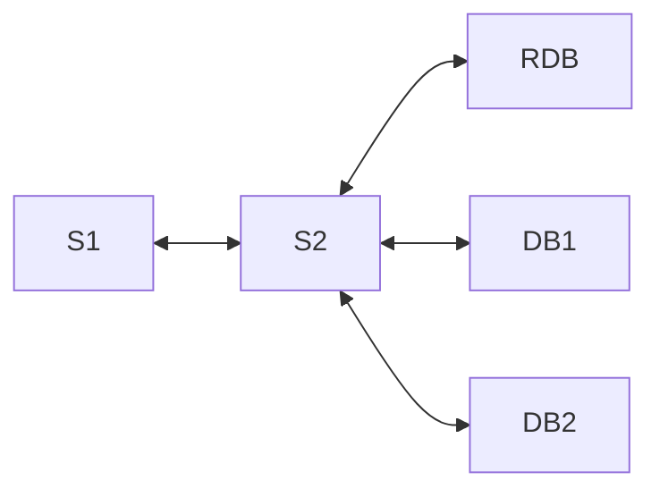

# KartManagementSQL

Grupo:
Matheus Ferreira de Freitas 22.125.085-5
Henrique Hodel Babler 22.125.076-4

---

## Descrição do Projeto:

### Descrição do Professor:

O objetivo deste projeto é estudar o armazenamento de dados em diversos bancos tendo o uso do dado pela aplicação como critério de escolha para o tipo de banco que será usado.
O tema do projeto é livre, porém a implementação deve seguir o seguinte modelo:
graph LR

em que:
- RDB é um banco relacional;
- DB1 e DB2 são bancos que não podem ser relacionais (NoSQL) e não podem ser o mesmo banco;
- S1: serviço que deve faz requisições ao serviço S2. Estas requisições podem conter tanto dados fictícios que serão armazenados no bancos como requisições de dados que estão nos bancos e que devem ser retornadas. Os dados fictícios gerados devem ser de pelo menos 3 tipos diferentes, sendo que cada um deles será armazenado em um banco diferente. O serviço S1 deve armazenar todos as respostas de S2 junto com as requisições realizadas para verificação do funcionamento de S1;
- S2: serviço(s) que receberá as requisições de S1 e devem realizar o armazenamento ou busca dos dados nos respectivos bancos. Esta parte pode ser implementada como apenas 1 serviço que lê todos os tipos de mensagem ou como diversos serviços que são responsáveis por tipos de dados diferentes;

---

### Descrição do Projeto (Grupo):

O grupo escolheu fazer um Gerenciador de Corridas inspirado no jogo Mario Kart.

- RDB: armazena dados dos jogadores.
- DB1: um banco do tipo document storage para armazenar os dados dos personagens, carros e pistas.
- DB2: um wide-column storage para armazenar os dados de todas as corridas realizadas.
- S1: deve gerar requisições sobre a união de jogadores e corridas.
- S2: dividido em 3 serviços — um responsável pelos jogadores, um pelos dados gerais (personagens, carros e pistas) e o último para tratar os pedidos de união entre jogadores e corridas.

#### Escolhas e justificativas
##### DB1 — Mongo DB

- Facilidade e ambos os membros já conhecem e já usaram o banco

##### DB2 — Neo4j (grafo)

- Por que: ideal para unir dados de diferentes bancos (jogadores do MySQL e corridas do Cassandra), criando relações como “Jogador ID01 usou o personagem Toad na pista Arco-Íris e seu melhor tempo foi 5 minutos”.
- Permite consultas complexas sobre desempenho, combinações de jogador/personagem/pista e recomendações.
- Também foi uma recomendação do professor da matéria.
- Amigável ao usuário: linguagem Cypher legível; ferramentas visuais (Neo4j Browser) facilitam exploração e análise.

##### RDB — MySQL (relacional)

- Por que: o grupo quer experimentar; é estável, amplamente suportado e simples de operar. Índices, FKs e CTEs dão conta do CRUD de Jogadores e também dos logs do S1.

